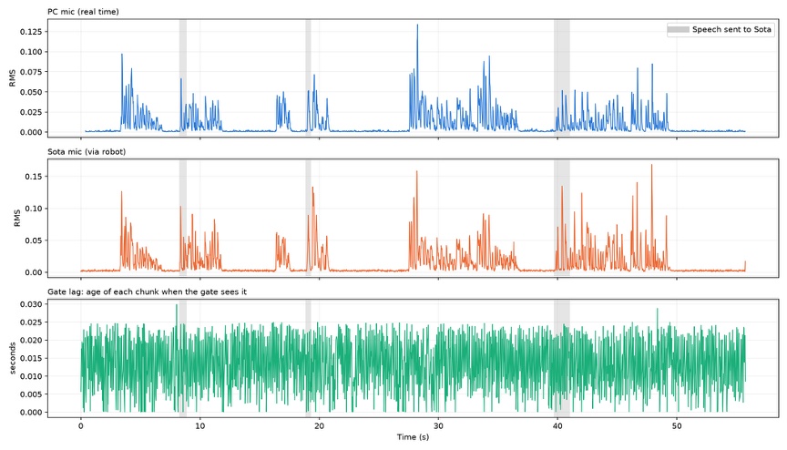

# Turn-taking with Sota: fixing the mic gate


In the end the problem was not the robot, it was my pipeline. Retico was calling my gate module slower than the mic was sending audio, so the audio piled up in a queue and everything was seconds late. After fixing that, the gate closes only for the time Sota is talking (10 s reply = 10.9 s closed) and reopens almost right away.

## Goal

I want a turn by turn conversation with Sota: I talk, Sota answers, I talk again. The main problem is that Sota hears itself. When Sota speaks, its own mic records its voice, the ASR transcribes it, and Sota repeats it again. So I need a gate that blocks the mic while Sota is talking and opens again when Sota finishes.

Two things I needed:

- No echo: Sota should never hear its own words.
- Fast: the gate should open as soon as Sota stops, so I can talk again without waiting.

## Setup

For testing I used an echo pipeline in retico (Sota repeats what I say), so I don't depend on the LLM. Later the LLM goes between the ASR and the TTS.

| Module | What it does |
| --- | --- |
| Sota mic | Sends Sota's mic audio over UDP in 20 ms chunks (50 per second) |
| Gate | Blocks or passes the mic audio |
| Whisper ASR | Turns my voice into text, commits when I stop talking (0.85 s silence) |
| Piper TTS | Turns the text into audio, 0.2 s frames |
| Sota speaker | Sends the audio to Sota over UDP |

The gate closes when the ASR commits (my turn is over) and has to decide when to open again.

## What I tried and why it did not work

I tried many ways to know when Sota stops talking. Every one worked for short replies and failed for long ones, which later made sense (see the cause below).

| # | Idea | What happened |
| --- | --- | --- |
| 1 | Camera: detect the red mouth LED of Sota | Worked to detect red, but the LED is turned on and off by my own code with a fixed delay, so it was not a real signal of Sota talking |
| 2 | Timers: speaker `busy_until` + wait 2.5 s idle + 0.8 s quiet | Reopened about 1.5 s after Sota stopped, too slow. With shorter timers it opened in the middle of long replies |
| 3 | TTS output energy (close when TTS sends speech, open when it stops) | Opened the moment the TTS stopped, but Sota was still talking, so the ASR caught the last words |
| 4 | Connect the TTS/speaker output to the gate as a second input and tell the IUs apart by tags (`iu.creator`, an `owner` tag in `meta_data`) | At first the extra connection was missing in the graph, so the gate never got Sota's audio and only reopened on the 10 s timeout. After connecting it, the gate knew when audio was sent but not when Sota really played it, so it opened while Sota was still talking, even with a 4 s hold |
| 5 | Predict the time: words x seconds per word, then the exact seconds sent + a tail | Good for short sentences. For long ones the tail was never enough |
| 6 | PC mic decides when Sota stops | Worked better, but Sota's mic audio still arrived late after opening, so I had to skip 1.2 to 2 s with a guessed `mic_delay` |
| 7 | Only RMS on Sota's mic (open on voice, close on silence) | Cannot tell my voice from Sota's, both are around 0.05 to 0.2 RMS |
| 8 | Turns: commit closes, RMS on Sota's mic reopens after a 0.6 s quiet window | Echo gone after I added: count Sota's voice only after the speaker started, and wait for all the sent seconds to play. But still slow: Sota "started" 10 s after close on a 10 s reply |

I also tried sending the TTS audio faster (sleep 0.02 s instead of 0.2 s). It made no difference, the gate still saw Sota about 4 s late.

At this point I thought the robot was the problem: that Sota's mic is late while Sota is speaking. I needed evidence before saying that.

## Measuring it

The measurements showed the robot is fine: Sota's mic and my PC mic hear Sota at the same time, but my gate was seeing the audio later and later.

What I recorded, all with the same clock:

- PC mic RMS (my MacBook mic, no network, so it is real time).
- Sota mic RMS (what the robot sends).
- When the speaker sends speech to Sota.
- Later: the age of each chunk when the gate gets it (`time.time() - iu.created_at`).

What I found, step by step:

1. By ear, Sota starts talking right when `[SPEAKER] speech` prints. So Sota plays on time.
2. In the plot, both mics show the same bursts at the same time. Per turn, Sota's mic was 0.02 to 0.17 s ahead of the PC mic, not behind. So Sota's mic is not late either.
3. The gate lag grew in a straight line, from 0 to about 5 s in 30 s, even when nobody was talking.
4. `process_update` in the gate took only 0.1 ms, but the chunks waiting in its queue grew about 10 per second, up to 548 (about 11 s of audio).

## The real cause and the fix

Sota's mic sends 50 chunks per second, but retico was calling my gate only about 40 times per second, one chunk per call. So every second about 10 chunks stayed in the queue, and the gate was always working on older audio. That is why long replies were worse: more time passed, so the gate was further behind. It also explains the echo: Sota's voice was still in the queue when the gate opened.

The fix: in each call, the gate also takes all the chunks that are already waiting in its queue (`get_nowait()` until it is empty) and processes them together.

The first code I used for this was inside `process_update`:

```python
messages = [update_message]
for q in self._left_buffers:
    while True:
        try:
            messages.append(q.get_nowait())
        except queue.Empty:
            break

out = UpdateMessage()
```

What it does, line by line:

- `messages = [update_message]` starts a list with the chunk retico gave me in this call.
- `self._left_buffers` are the input queues of the module (where the chunks wait before the gate gets them).
- `q.get_nowait()` takes the next waiting chunk without waiting. If the queue is empty it raises `queue.Empty` instead of blocking.
- The `while True` + `break` keeps taking chunks until the queue is empty. So after this, `messages` has the current chunk plus everything that was waiting.
- `out = UpdateMessage()` is the message that will go to the ASR with the chunks that pass the gate.

The problem was what came after: the loop still said `for iu, ut in update_message`, so it only processed the first chunk and the ones taken from the queue were lost.

In the final version I moved that part into its own method, `_drain`:

```python
def _drain(self, update_message):
    # retico calls us slower than the mic sends chunks, so take everything waiting
    messages = [update_message]
    for q in self._left_buffers:
        while True:
            try:
                messages.append(q.get_nowait())
            except queue.Empty:
                break
    return messages
```

`_drain` does the same thing as the first code (current chunk + everything waiting) but returns the list. Then `process_update` loops over all of it with `for um in self._drain(update_message): for iu, ut in um:`, so every chunk is checked by the gate and, if the gate is open, sent to the ASR. Nothing is skipped and nothing stays waiting.

| Measure | Before | After |
| --- | --- | --- |
| Chunks waiting in the gate queue | grew up to 548 | 0 |
| Gate lag | grew to 5 to 11 s | under 0.03 s |
| Sota heard after close, short reply | 1.6 s | 0.3 s |
| Sota heard after close, 10 s reply | 10.4 s | 0.9 s |
| Gate closed, 10 s reply | 23.5 s | 10.9 s |
| Extra wait after Sota stops | 0.5 to 1.5 s | 0 to 0.06 s |




What the plot says (this is after the fix). The 3 panels use the same time, and the gray parts are when the speaker is sending speech to Sota (the plots can be reproduced using the commit "data raw saved: speed improved, plot the audio and speed compared with the pc audio").

- Top, PC mic: this is my Mac mic, there is no network in the middle so I use it as the real time. Every burst is someone talking, me (outside the gray) or Sota (starting at the gray).
- Middle, Sota mic: what the robot sends. The bursts are at the same time and look the same as the PC mic. In the numbers Sota's mic was even 0.02 to 0.17 s before the PC mic. So the mic of Sota is not late, the robot sends the audio in real time.
- Bottom, gate lag: how old each chunk is when the gate gets it. It stays between 0 and 0.03 s all the time, it does not grow and it does not jump when Sota talks. Before the fix this line was going up straight until 5 s.

So my interpretation is: Sota plays on time, Sota's mic is on time, and now the gate is also on time. The gate decides with the audio of now and not with audio of some seconds ago. That's why the gate is closed almost the same time Sota talks (10.9 s for a reply of 10 s) and the echo is not there anymore.


After the fix: the two mics still match, and the gate lag stays flat under 30 ms for the whole run.

One mistake I made on the way: my first version of the fix took the waiting chunks but then only looped over the first message, so the extra chunks were thrown away (about 1 in 5 never reached the ASR). The final version loops over all of them.

## What I learned and next steps

The biggest lesson for me: measure before blaming something. I spent a lot of time changing timers and thresholds, and I was sure the robot was late, but one plot with two mics on the same clock showed it was my code.

Other things I learned:

- Retico modules run in their own threads with their own queues, and a module can fall behind even if its own code is fast.
- Logging the age of each chunk (`created_at`) is a simple way to see if a module is behind.
- RMS alone cannot tell who is talking, the speaker signal is needed to know it is Sota's turn.

Next steps:

- [ ] Find where the module loop waits (a `sleep` or `timeout` in `execution_manager.py` or retico's `abstract.py`) and fix it there.
- [ ] Check the other modules (ASR, TTS, speaker) for the same queue problem.
- [ ] Put the LLM back between the ASR and the TTS and test with real replies.
- [ ] Remove the debug prints once everything is stable.
